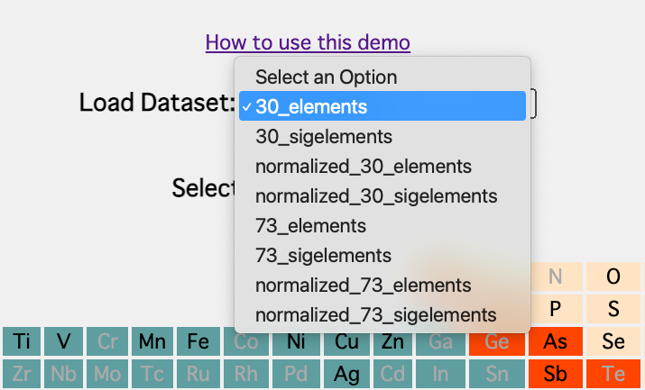
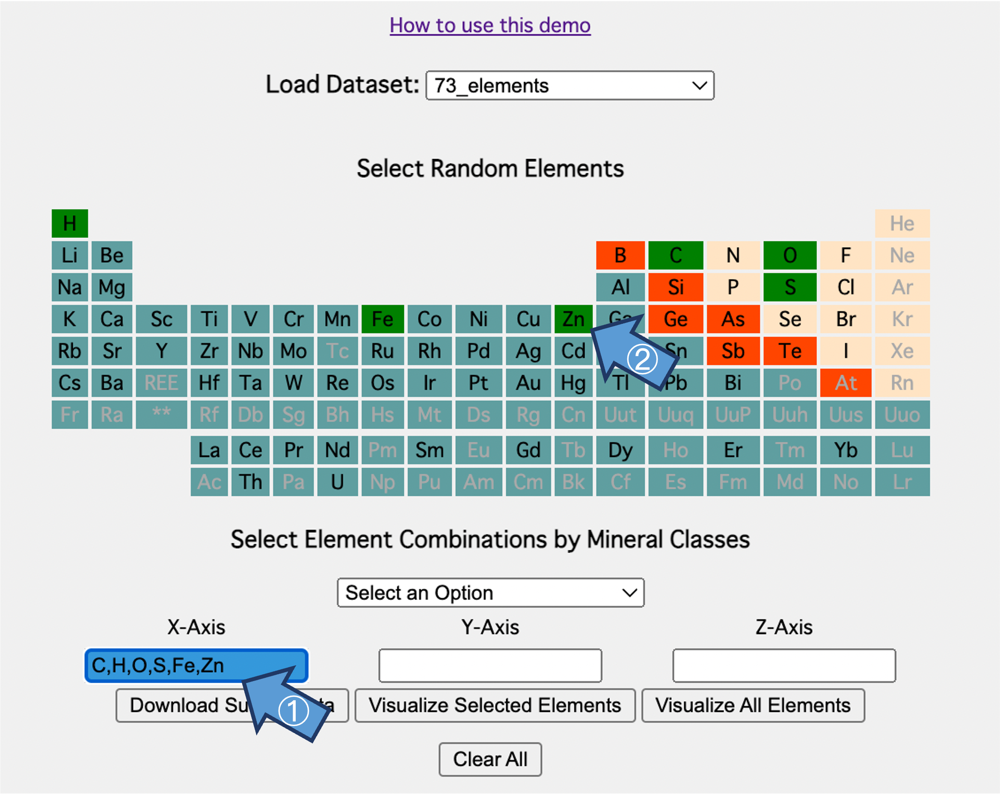
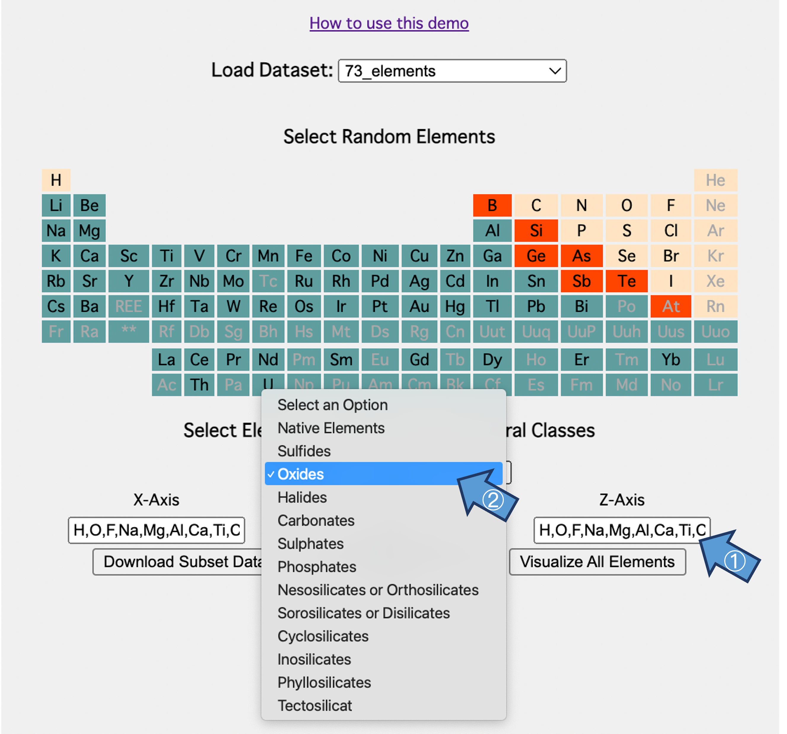
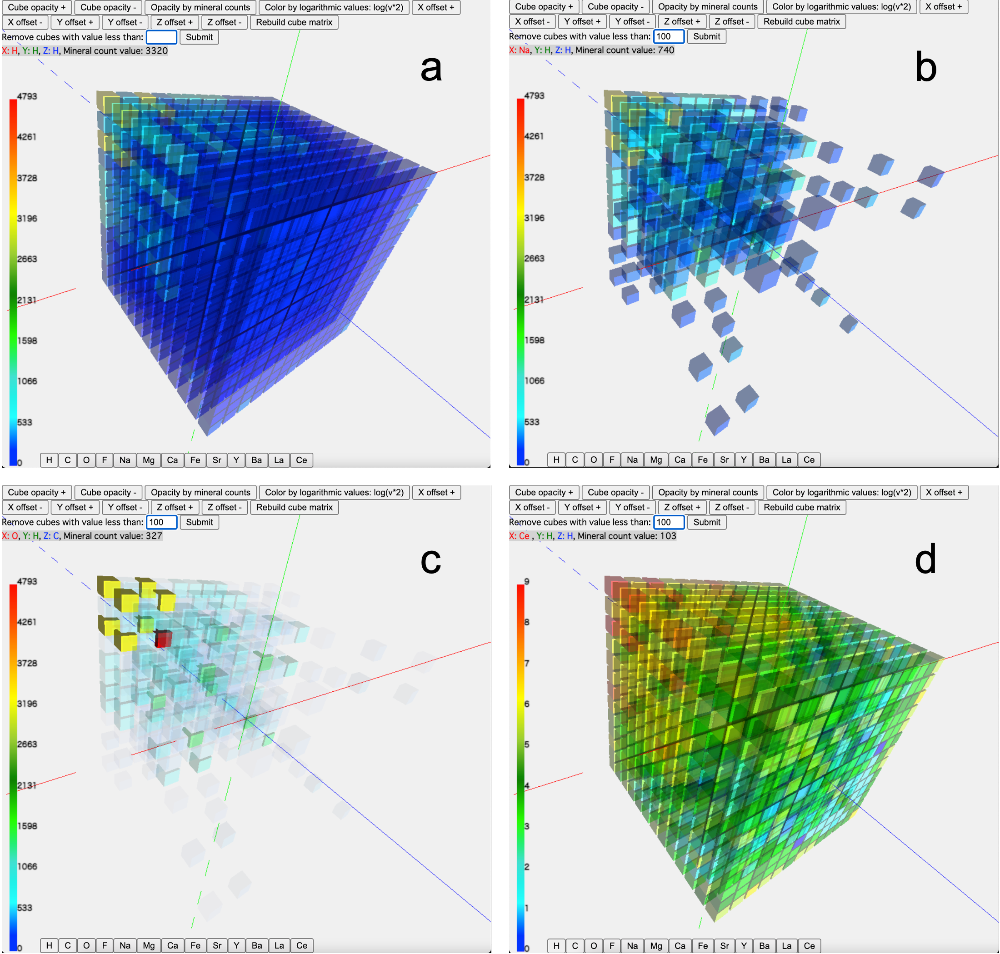

# A 3D heat map for exploring patterns of co-relationships minerals with open data

The [demo system](http://tickmap.nkn.uidaho.edu/D3Cube) is optimized to run in Chrome and Safari. In particular, it is recommended to use Chrome to visualize the big $72^3$ 3D heat map. However, for other use cases with smaller datasets, Safari will be fine.  

## Get started
The general workflow is as below:

### 1. Load the dataset
Go to [demo system](http://tickmap.nkn.uidaho.edu/D3Cube). 

Start from the top of the website. Then, the user can load the element dataset from the drop-down list (for datasets details, see section [Datasets](#datasets)). 

Once a dataset is loaded, the elements comprised in the dataset will be highlighted in the periodic table.

### 2. Select the elements

To render the element co-relationships in the 3D space, the user needs to select at least one chemical element for each of the three axes. There are two approaches to filling out the axes. 

a) By clicking the targeted axis, the user can choose the elements from the periodic table to put in the axis box; then, repeat this operation until all the axes are filled with elements.

b) Instead of filling the axes element by element, we provided a series of combinations for quick selection. Like the former method, the user should click the axis first, then choose the combinations from the drop-down list below the periodic table. The element combinations are derived from the classes of primary igneous minerals ([Source](http://www.minsocam.org/MSA/Ammin/AM_Preprints/8539HazenPreprint.pdf)).

> In the current demo, the combination selection is only available for the datasets with 73 elements.

Upon completing axes filling, users can download the subset data of selected elements in `.csv` format.

### 3. Render the 3D heat map

Users can either render the 3D heat map with selected elements in three axes or skip the selection and render all elements in the dataset.

In the rendered page of the 3D heat map, several ways exist to interact with the cubes and gain insight from the dataset. The available operations include but are not limited to filtering cubes by their values, adjusting the opacity for the cubes, coloring by logarithmic values, slicing sample sections from the entire cubes, etc.

## Datasets
For the data cleansing workflow, please refer to this [GitHub Repository](https://github.com/ChuBL/3DHeatmapDataPreprosses).
By 02/23/2023, there are eight datasets on the demo system:

#### Subset 30 Common Elements Datasets

- `30_elements.csv` Elements cooccurrence 3D matrix, comprises of as a concatenated 2D matrices of **30 top frequency** elements in Mindat attribute `elements`.

- `30_sigelements.csv` Elements cooccurrence 3D matrix, comprises of as a concatenated 2D matrices of **30 top frequency elements** in Mindat attribute `sigelements`.

- `normalized_30_elements.csv` *Normalized* elements cooccurrence 3D matrix, comprises of as a concatenated 2D matrices of **30 top frequency elements** in Mindat attribute `elements`.

- `normalized_30_sigelements.csv` *Normalized* elements cooccurrence 3D matrix, comprises of as a concatenated 2D matrices of **30 top frequency elements** in Mindat attribute `sigelements`.

#### All Elements Datasets

- `73_elements.csv` Elements cooccurrence 3D matrix, comprises of as a concatenated 2D matrices of **all elements** in Mindat attribute `elements`.

- `73_sigelements.csv` Elements cooccurrence 3D matrix, comprises of as a concatenated 2D matrices of **all elements** in Mindat attribute `sigelements`.

- `normalized_73_elements.csv` *Normalized* elements cooccurrence 3D matrix, comprises of as a concatenated 2D matrices of **all elements** in Mindat attribute `elements`.

- `normalized_73_sigelements.csv` *Normalized* elements cooccurrence 3D matrix, comprises of as a concatenated 2D matrices of **all elements** in Mindat attribute `sigelements`.

All datasets are derived from the [Mindat database](https://www.mindat.org/). 
